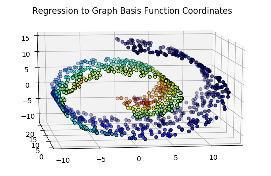

# A Comparison of Graph Construction Methods for Machine Learning

## Motivation - TL;DR:

In cases where Euclidean distance is a poor measure of distance between data points, we can impose a graph structure on the data which better represents distance between points. Especially in the case with much more labeled data than unlabeled data, this structure gives us information about the relative distances between the labeled data points, improving the performance of machine learning algorithms. This repository explores which method of constructing that graph results in the best-performing machine learning algorithms.

## Usage:

Since all of this repository is implemented in Jupyter Notebooks, the easiest way to access the notebooks is by using the 'Open in Colab' badges below:

Basis Functions on Graphs: 

Regression on Points Represented in Terms of Graph Basis Functions: []
(https://colab.research.google.com/github/jastern33/graph-construction-semi-supervised/blob/master/basis_functions_on_graphs/graph_regression.ipynb)

Comparison of Graph Construction Methods: Not yet modified for Colab

## Motivation - elaborated:

Euclidean space is huge, and the dataset of interest often occupies a very small manifold within Euclidean space. Often, distance in terms of that manifold is more significant than distance in Euclidean space.

Take, as a concrete example, the swiss roll dataset.

Consider a point `x_1` on the outside tip of the 'roll'. Now consider a point `x_2` directly below `x_1`. Finally, consider a point `x_3` farther below `x_1` at the bottom of the swiss roll. In Euclidean distance, `x_1` is closer to `x_2` than to `x_3`. However, if we were to 'un-roll' the swiss roll, we would find that `x_1` is much closer to `x_3` than to `x_2`. This is an example where data lies on a manifold that isn't measured well by Euclidean distance.

Why is this relevant to machine learning?

Suppose we have a set of inputs that we believe are related to a set of outputs -- let's say, height `H` and salary `S` -- by an unknown function `f`. We sample a training set of heights and salaries, `{X, Y}`, from `H x S`. The inductive bias of machine learning is that a true function `f` maps points close together in `X` to points close together in `Y`. So if we can find a function `f'` that predicts outputs `Y` for inputs `X`, then `f'` will map new points close to `X` to the correct region in `S`.

But what if our distance measure is off? Take our points `x_1` and `x_2` from the previous example, and suppose they are from the domain `H` of heights. They are close in Euclidean distance but far in terms of distance on the manifold. If `f'` is a machine learning model that is trained on representations of `X` in Euclidean space, it will map `x_1` and `x_2` to similar points in the codomain `S`, when in reality they should map to totally different parts of `S`.

What is the solution? How can we better measure "manifold distance" instead of Euclidean distance?

One way is to impose a *graph structure* on the data. We construct a graph by using Euclidean distance (generally) to connect each point to a few of its nearest neighbors, and then use graph-based machine learning algorithms.

This is especially helpful when there are few labeled points (say, 10) and many unlabeled points (say, 1000). Constructing a graph based on all of the data points (labeled and unlabeled) gives us much more information about the position of the labeled points on the data manifold. The premise of semi-supervised learning is that we can use unlabeled points to learn more about the total data manifold and tune machine learning algorithms with fewer labeled data points. Thus, one approach to semi-supervised learning is to impose graph structure that describes the distance of points from each other in terms of the graph manifold.

This repository explores the question: What is best graph construction method for machine learning? 

There are two parts. The first folder, `basis_functions_on_graphs`, includes two demos that explain how to represent points on the graph manifold, and how that representation can be useful for machine learning.

The second folder, `graph_based_learning_comparison`, contains code to compare the performance of several graph-based learning algorithms (for now, an SVM) on data made by different graph construction methods (for now, KNN and UMAP).
